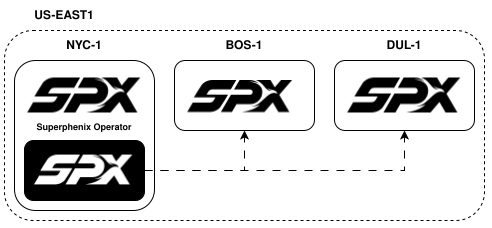

# Installing inside an AZ

In this model, the **management cluster** runs on the same Kubernetes cluster as one of your Superphenix availability zones. The operator, web console, and GitOps components live alongside the workload stack on that AZ.

Part of the [deployment guide](../index.md). For the alternative placement, see [Installing outside an AZ](management-outside-az.md).

## Overview



The operator and console run on one of the workload clusters. This is easier to bootstrap but creates a dependency on the hosting AZ.

## When to choose this model

- **Single AZ** or **isolated AZs**: each AZ has its own management cluster and control plane manages only that AZ.
- **Security boundaries**: strict isolation between AZs, with no shared management plane.
- **Labs and first deployments**: simplest path when you start from one hyperconverged cluster.

## Requirements

- The management cluster must be a **pre-existing Talos Linux** cluster before you install the `superphenix-operator` Helm chart.
- Bootstrap that cluster with [Manual OS installation](../installing-the-os/manual-os-installation.md) (or an existing Talos cluster you already operate).
- Size the AZ for both **workload** and **management** components on the same nodes.

## Trade-offs

| Aspect | Notes |
|--------|--------|
| **Deployment** | Easier to deploy: one cluster to provision |
| **Maintenance** | Easier day-to-day: no separate management fleet |
| **Multiple AZs** | If one management cluster controls several AZs, the hosting AZ is a **single point of failure** |
| **Failover** | Management is tied to one AZ; failover is harder |
| **Dependency** | Management runs on Superphenix (same stack as the AZ) |

## How to install the operator

Installation of the operator is typically done via Helm on the AZ cluster that will host management:

```bash
helm upgrade --install superphenix-operator \
  ghcr.io/super-phenix/charts/superphenix-operator \
  --namespace superphenix-system \
  --create-namespace
```

When the operator runs on the same cluster as the AZ, define that cluster with `connection.mode: Local`. The operator connects in-process and does not need a remote API URL or credentials secret.

```yaml
apiVersion: operator.superphenix.net/v1alpha1
kind: Cluster
metadata:
  name: cluster-local
  namespace: superphenix-system
spec:
  deploymentTopology: Hyperconverged
  region: us-west-2
  availabilityZone: us-west-2a
  version: 0.0.0-latest
  connection:
    mode: Local
  systemConfiguration:
    apps: {}
```

See [Configure a cluster](../installing-an-az/configuring-a-cluster.md) for the full `Cluster` resource reference.

## Next steps

1. [Manual OS installation](../installing-the-os/manual-os-installation.md): bootstrap Talos on the AZ that will host management (if not already done).
2. Install the operator using the Helm command above.
3. [Installing an AZ](../installing-an-az/index.md): define `Cluster` resources for your AZs (`Local` for the hosting cluster, `Remote` for any others).

See [Deployment topology](../../../architecture/deployment-topology.md) for the full comparison with management outside an AZ.
