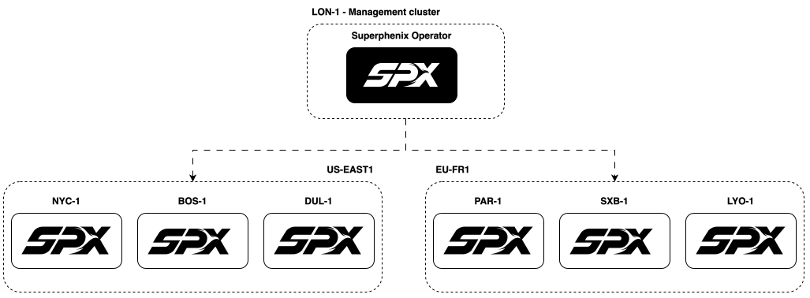

# Installing outside an AZ

In this model, the **management cluster** runs on a **dedicated, neutral** Kubernetes cluster separate from every workload AZ. A single control plane can orchestrate one or many Superphenix clusters from that management environment.

Part of the [deployment guide](../index.md). For the alternative placement, see [Installing inside an AZ](management-inside-az.md).

## Overview



The control plane runs outside your workload AZs. This is recommended for multi-AZ orchestration and maximum redundancy.

## When to choose this model

- **Multi-AZ at scale**: one management cluster orchestrates many AZs.
- **Redundancy**: management is independent of any workload AZ.
- **Greenfield datacenters**: pair with [Automated OS installation](../installing-the-os/automated-os-installation.md) for hands-off server provisioning on workload clusters.

## Requirements

!!! important
    The management cluster needs connectivity to the **Kubernetes API** of every Superphenix cluster it will manage.

- You can install the operator on **any conformant Kubernetes cluster** (v1.28+), as long as it can reach the control plane of each destination cluster.
- The management cluster does **not** need to be Talos; it can run on vanilla Kubernetes or even another cloud, as long as network paths to your AZs are reliable.
- Plan **GitOps** and **API** connectivity from management to every AZ before you define `Cluster` resources.

## Trade-offs

| Aspect | Notes |
|--------|--------|
| **Deployment** | Harder: an additional cluster to provision and operate |
| **Maintenance** | Harder: separate management fleet to patch and monitor |
| **Multiple AZs** | Easier to manage many AZs from one neutral control plane |
| **Failover** | Easier: management is not tied to any workload AZ |
| **Dependency** | No chicken-and-egg: management does not depend on Superphenix workload stacks |

## How to install the operator

Installation of the operator is typically done via Helm on your dedicated management cluster:

```bash
helm upgrade --install superphenix-operator \
  ghcr.io/super-phenix/charts/superphenix-operator \
  --namespace superphenix-system \
  --create-namespace
```

For advanced Helm values and management stack settings, see [Full configuration](full-configuration.md).

## Next steps

1. Provision a management Kubernetes cluster (any supported distribution).
2. Install the operator using the Helm command above.
3. [Full configuration](full-configuration.md): configure the management stack (console, ArgoCD, and related components).
4. [Installing the OS](../installing-the-os/manual-os-installation.md) or [Automated OS installation](../installing-the-os/automated-os-installation.md): provision workload AZ clusters.
5. [Installing an AZ](../installing-an-az/index.md): register each AZ with a `Cluster` resource (`connection.mode: Remote`).

See [Deployment topology](../../../architecture/deployment-topology.md) for the full comparison with management on an AZ.
