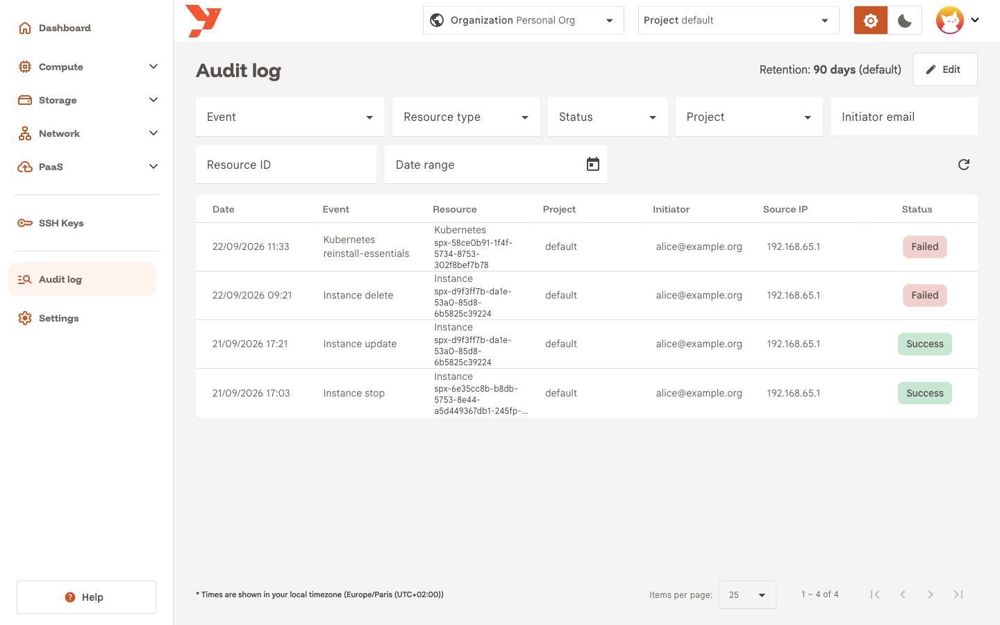
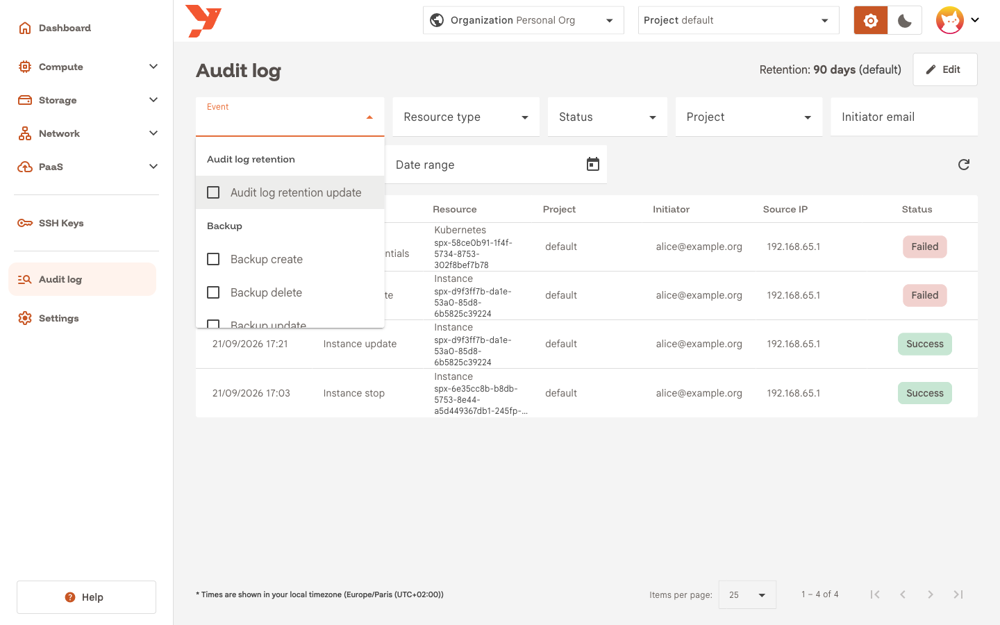
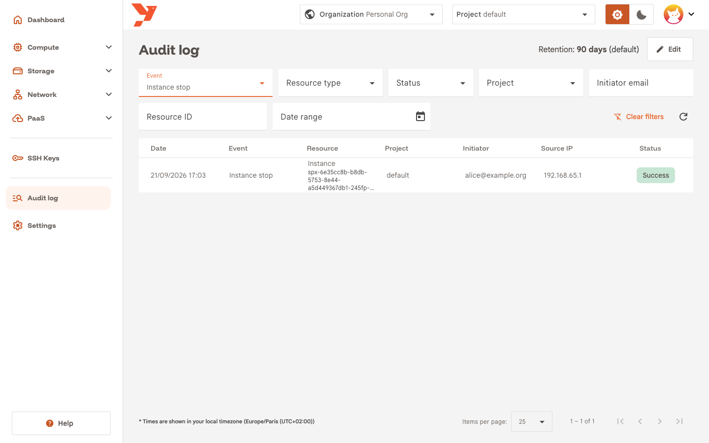
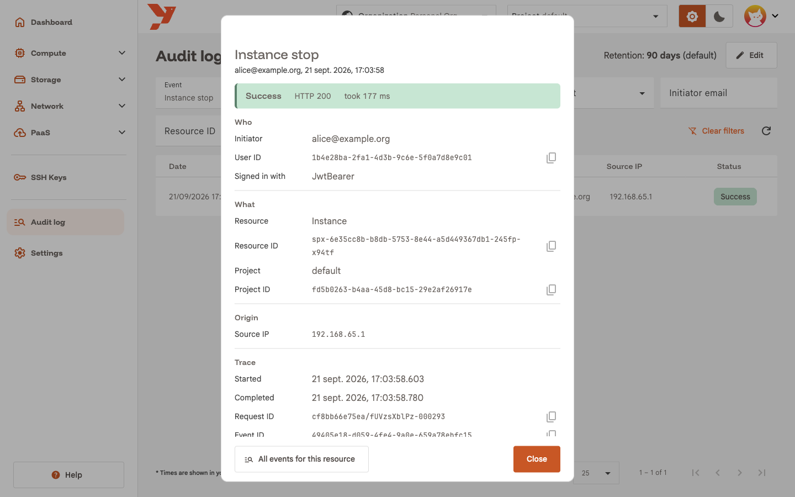
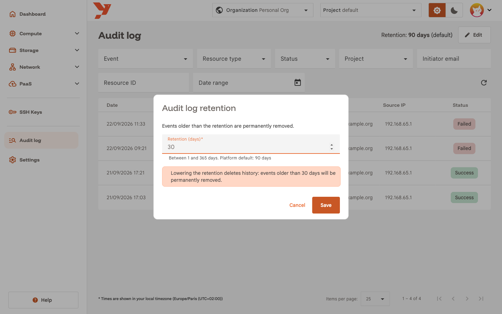
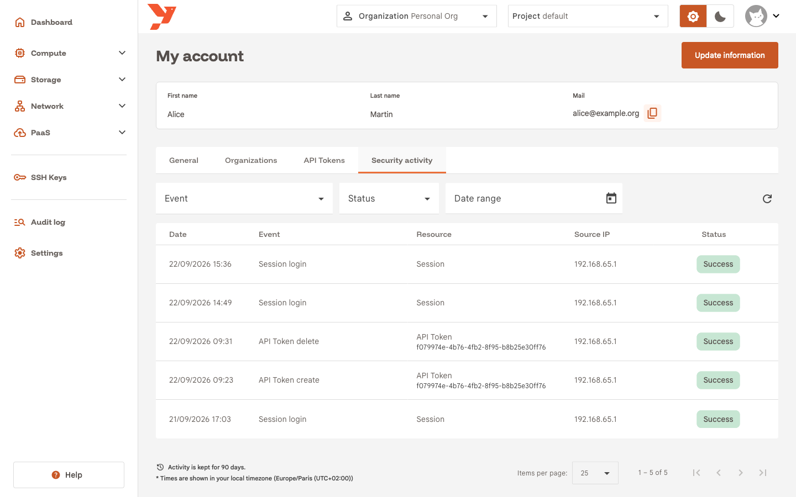

# Read the audit log

The audit log lists each change made through the API of your organization: who did it, on which resource, from which address, and whether it worked. This guide answers one question with it, who stopped a VM yesterday and when, then covers the retention setting and your own sign-in history.

For the concepts behind the page, read [Audit Log](../../features/audit-log.md).

## Before you start

- Select your organization in the top bar. The log covers that organization, whatever project is selected.
- Hold a role with audit log read access: the predefined **Admin** group, or a group with the `AuditLogReadOnly` permission set. Without it the **Audit log** entry stays hidden.

## Open the audit log

In the sidenav, click **Audit log**, below **SSH Keys**.

The header shows the current **Retention**. The table lists the newest events first, 25 per page, one row per request:

| Column        | Content                                                                                                     |
| ------------- | ----------------------------------------------------------------------------------------------------------- |
| **Date**      | When the request passed authentication, in your local timezone. Hover it for the UTC value.                 |
| **Event**     | Resource and action, for example **Instance stop**. Hover it for the raw type, `instance.stop`.             |
| **Resource**  | Resource label and ID.                                                                                      |
| **Project**   | Project the request was scoped to. `-` for organization-level events such as a member invitation.           |
| **Initiator** | Email of the user who sent the request.                                                                     |
| **Source IP** | Client address as seen by the gateway.                                                                      |
| **Status**    | **Success**, **Failed** or **Attempted**.                                                                   |

**Attempted** means the gateway never recorded the outcome. You see it when the gateway stopped before the request completed.

Use the paginator at the bottom to change the page size or move between pages. The table has no sorting and no free-text search. The filters do that job.

## Filter the events

Yesterday a VM stopped and nobody on the team remembers stopping it. Narrow the log down:

1. Click **Event**. The list groups the event types by resource. Tick **Instance stop** and click outside the list to close it.

    

2. Click the calendar icon next to **Date range**, pick yesterday as both **From** and **To**, and close the picker. The range applies when the picker closes.
3. Optional: set **Project** to the project that holds the VM.

The table reloads with the matching rows. A **Clear filters** button appears next to the refresh icon as soon as one filter is set.

Each filter maps to a query parameter in the page URL, such as `?eventType=instance.stop&from=2026-09-21&to=2026-09-21`. Copy the URL to send a colleague the same view.

The other filters:

- **Resource type** narrows to one resource without ticking each of its actions.
- **Status** set to **Failed** shows the refused requests alone, the first thing to check when an automation breaks.
- **Initiator email** and **Resource ID** take an exact value and apply when you press Enter or leave the field.
- **Event** accepts up to 50 types at once. **Retired event types**, under **Miscellaneous**, selects events whose type this version no longer declares.

The page has no live update. Click the refresh icon to reload the current page.

## Inspect an event

Click the **Instance stop** row. A dialog shows the full event.

The banner at the top gives the outcome, the HTTP status and how long the request took. Below it, four groups:

- **Who**: **Initiator**, **User ID** and **Signed in with**. The last one is the authentication method: `JwtBearer` for the console, `ApiTokenAuth` for an API token, `KratosSession` for the sign-in itself.
- **What**: **Resource**, **Resource ID**, **Project** and **Project ID**. A project deleted since then shows as **Deleted or unknown project**.
- **Origin**: **Source IP**, taken from the proxy headers.
- **Trace**: **Started**, **Completed**, **Request ID**, **Event ID** and **Event type**. The request ID matches the gateway logs, so give it to your operator when you open a ticket.

The copy icon next to an ID puts it on the clipboard.

**All events for this resource** replaces your filters with the event's **Resource ID** and closes the dialog. You get the full history of that VM: creation, updates, stops, and the deletion if there was one.

## Change the retention

The gateway deletes events older than the retention for good. The header shows the current value, with **(default)** when the organization has no override.

1. Click **Edit** next to **Retention**. The button needs the `AuditLogFullAccess` permission set. Other users see no button.
2. Type a value in **Retention (days)**. The hint shows the bounds set by your platform operator and the platform default.
3. Click **Save**.

!!! warning
    A lower value deletes history. The dialog warns you, and a second dialog, **Lower the audit log retention?**, asks for confirmation. Events older than the new value disappear at the next sweep, within the hour, and nothing brings them back.

**Reset to default** appears once an override is set and removes it. The change itself lands in the log as **Audit log retention update**.

## Your own activity

You can read your own sign-ins and API token operations whatever your role. Open the avatar menu in the top right, click **My Account**, then the **Security activity** tab.

The table has the same shape without **Project** and **Initiator**, and the filters shrink to **Event**, **Status** and **Date range**. A **Session login** row is one sign-in through the console. A sign-in from an address you do not recognise is the signal to change your password and revoke your tokens under **API Tokens**.

These events belong to you, so they never appear in the organization log. The footer shows how long the platform keeps them. You cannot change that value.

## Next

- [Audit Log](../../features/audit-log.md) for the event fields, the full list of event types and the permissions.
- [Web console](../../operations/console.md) for how authentication and roles fit together.
